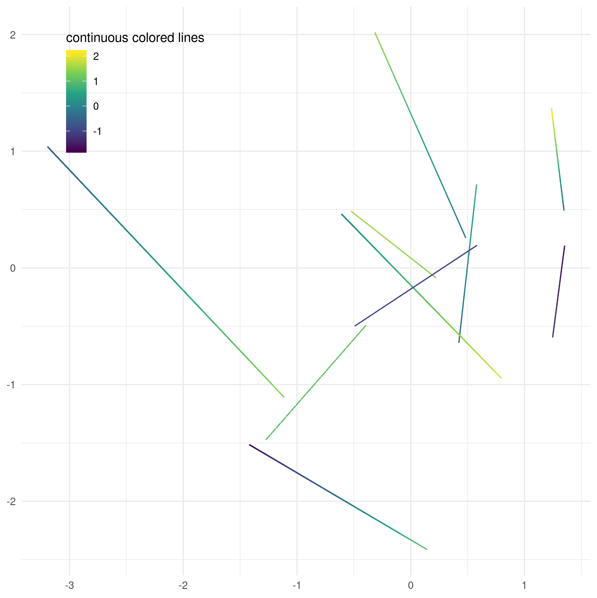

## geom_cake


[](https://guangchuangyu.github.io/cn/2017/12/geom-cake/)

<https://guangchuangyu.github.io/cn/2017/12/geom-cake/>

## geom_flat_violin

source code from <https://gist.githubusercontent.com/benmarwick/2a1bb0133ff568cbe28d/raw/fb53bd97121f7f9ce947837ef1a4c65a73bffb3f/geom_flat_violin.R>, authored by [David Robinson](https://github.com/dgrtwo).

Useful for creating [raincloud plot](https://micahallen.org/2018/03/15/introducing-raincloud-plots/).

Alternatively, you can use [ggridges](https://CRAN.R-project.org/package=ggridges) for the raincloud effect.

see also <https://peerj.com/preprints/27137v1/>.

[](https://guangchuangyu.github.io/cn/2018/11/raincloud/)


<https://guangchuangyu.github.io/cn/2018/11/raincloud/>

## geom_ord_ellipse

[](https://guangchuangyu.github.io/cn/2018/01/geom-ord-ellipse/)

<https://guangchuangyu.github.io/cn/2018/01/geom-ord-ellipse/>

## geom_segment_c

see also <https://yulab-smu.github.io/treedata-book/chapter4.html#fig:continuousColor>.

```r
set.seed(2019-06-28)
d = data.frame(x = rnorm(10),
        xend = rnorm(10),
        y = rnorm(10),
        yend = rnorm(10),
        v1 = rnorm(10),
        v2 = rnorm(10))

library(ggplot2)
library(gglayer)

ggplot(d) + geom_segment_c(aes(x = x, xend = xend, y=y, yend =yend, col0 = v1, col1 = v2)) +
    scale_color_viridis_c(name = "continuous colored lines") + 
    theme_minimal() + theme(legend.position=c(.2, .85)) + xlab(NULL) + ylab(NULL)
```


[](https://yulab-smu.github.io/treedata-book/chapter4.html#fig:continuousColor)
